# Reporte de Resultados

## Introducción

La depresión es un transtorno de la salud mental muy prevalente que afecta significativamente a la interacciones sociales de los individuos y se ha clasificado como la principal causa de discapacidad en todo el mundo @nice2019. Se ha postulado que las teorías de aproximación-evitación pueden contribuir significativamente a la comprensión de la salud mental @corr2013, y en particular a trastornos como la depresión.

Las conductas de aproximación son aquellas que permiten ir hacia recompensas y las conductas de evitación implican la defensa/autoprotección del individuo y suelen ser activadas por estímulos aversivos. En este marco, el conflicto de aproximación-evitación se refiere a situaciones que implican tanto recompensa como estímulos aversivos @aupperle2011

En el caso de la depresión, la misma se ha caracterizado por un sistema de aproximación disminuido (relacionado con sentimientos de anhedonia) y un sistema de evitación hiperactivado, lo que lleva a las personas a evitar estímulos amenazantes o que puedan ser persividos como aversivos @ironside2020

En los ultimos años se ha destacado la necesidad de generar tareas interactivas que permitan estudiar los comportamientos de acercamiento y evitación en las personas @kirlic2017. Pese a esta necesidad, aun son escasos los estudios en humanos que utilizan tareas interactivas y casi no se cuenta con tareas interacctivas sociales que permitan estudiar estos comportamientos.

Esto es importante ya que la depresión, así como otros trastornos mentales, afectan significativamente al el funcionamiento social @ferster1973

## Metodos

Tarea social interactiva del conflicto de acercamiento -

evitación en contexto de competencia

**Etapas de la tarea**

Se implementó una tarea del conflicto de acercamiento - evitación basada en la competencia

(tarea de competencia)(Figura 1). Para el diseño de la misma se tomaron cómo insumos la

tarea TEAM2 (Acuña, 2018) diseñada por el equipo de investigacion donde se llevó adelante

este proyecto de grado, así cómo elementos de otras tareas de acercamiento - evitación

presentes en la literatura (Aupperle et al., 2015; Ironside et al., 2020; McDermott et al., 2021;

Schlund et al., 2016; Schultz et al., 2019; Smith et al., 2021). Con base en estos insumos se

diseñó la tarea de competencia que se utiliza en este estudio. Esta tarea consta de dos

etapas:

**Etapa 1: establecimiento de una jerarquía social**

En una primera etapa se comenzaba categorizando al participante ( Figura 1A). Para esto se

le pedía al/a la participante que respondiera un total de diez preguntas de cultura general

(estilo trivia) con dos posibles opciones de respuestas (se eligieron preguntas de alto nivel de

dificultad de forma que es muy poco probable que el/la participante conozca la respuesta), y

se le decía que se le asignaría una categoría de acuerdo a cuantas preguntas lograra

contestar correctamente; si hubieran pocas respuestas correctas serían categorizados como

un participante de una estrella; si respondía bien a todas las preguntas o a la mayoría serían

categorizados cómo 4 estrellas, y si contestaran algo intermedio se les asignaría las

categorías 2 o 3 estrellas. Sin embargo, tal cómo ocurre en otros estudios y a efectos de

estandarizar el experimento y que todos los participantes se enfrentarán a la misma tarea

(Fernández-Theoduloz et al., 2019; Uriarte-Gaspari et al., 2022), la categoría en la que

acababa asignado el participante estaba preestablecida. Todos los participantes fueron

asignados cómo jugadores de una estrella, indistintamente de cómo hubieran jugado, a

efectos de favorecer las comparaciones sociales hacia arriba durante la tarea y el que los

participantes seleccionaran (al menos algunas veces) la opción individual.

**Etapa 2: toma de decisiones**

Luego de que él/la participante viera en qué categoría quedó asignado/a se procedía a la

segunda parte de la tarea, en la cual se volvía a contestar preguntas de cultura general

(también de muy alta dificultad), pero esta vez pudiendo competir con supuestos rivales

conectados a través de internet. (Figura 1B). Acerca de esta parte se le decía a él/la

participante que en cada ronda debía optar entre dos opciones de juego. Una de las opciones

(opción social) implicaba recibir una recompensa, la cual estaba indicada por una barra gris (1

a 4 puntos), pero también implicaba tener que competir respondiendo a una pregunta estilo

trivia con un/a rival de cierta categoría (1 a 4 estrellas dependiendo de la ronda). La otra

opción (opción individual) implicaba recibir una recompensa mínima (únicamente 1 punto)

pero permitía evitar la competencia.

En caso de elegir la opción social, el participante automáticamente recibía los puntos

correspondientes a esa ronda (por ej., si en la ronda la opción social ofrece 3 puntos el

participante se llevaria esos puntos) y pasaba a contestar la pregunta compitiendo con un/a

supuesto rival. Se le decía al participante que el sistema le asignaria un co-jugador de la

categoría correspondiente a la ronda (por ejemplo si el participante aceptaba competir con

alguien de 4 estrellas, se suponía que el sistema le asignaba un rival de 4 estrellas), que

también hubiera elegido competir con alguien de la categoría del participante (1 estrella).

Luego se pasaba a contestar la pregunta de cultura general. Finalmente el participante recibía feedback de cómo había respondido él/ella a la pregunta y cómo la había respondido él/la rival. Habían 4 posibles feedback: que el participante hubiera contestado bien la pregunta y él/la rival bien ("Tú bien, Rival bien"), él/la participante bien y él/la rival mal ("Tú bien, Rival mal"), él/la participante hubiera respondido mal y él/la rival bien ("Tú mal, Rival bien") o que ambos, participante y rival contestaran mal la pregunta ("Tú mal, Rival mal") (ver Figura 1C).

En caso de elegir la opción individual, él/la participante recibía automáticamente un punto en esa ronda y pasaba a contestar a la pregunta de manera individual. El participante recibía dos posibles feedback: participante bien ("Tú bien") o participante mal ("Tú mal") (ver Figura 1C).

```{}
```

### 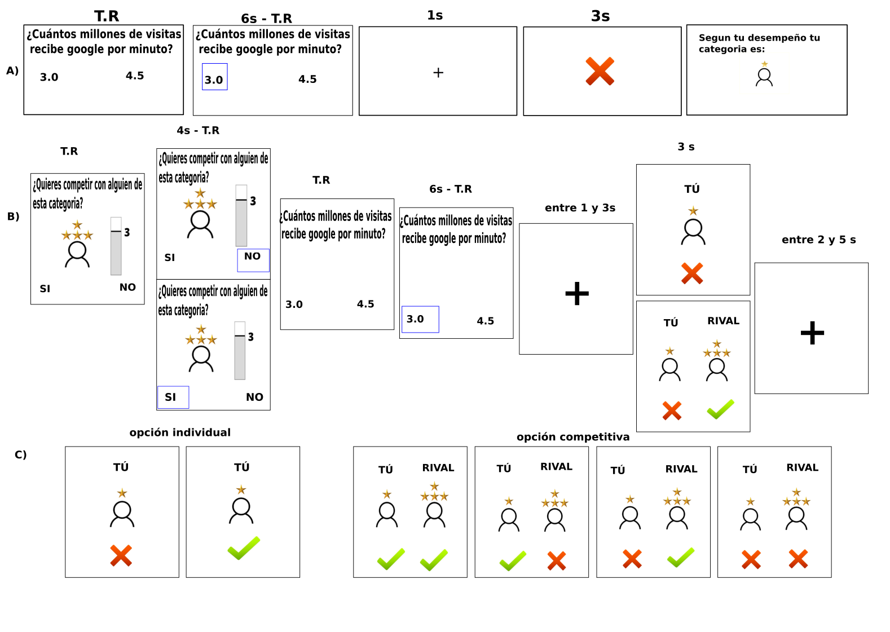

~[Figura\ 1.\ A)\ Etapa\ 1\ establecimiento\ de\ la\ jerarquía\ social.\ El\ participante\ contesta\ 10\ preguntas\ de\ cultura]{.smallcaps}~

~[general\ y\ se\ le\ asigna\ la\ categoría.\ Si\ bien\ se\ le\ dice\ al\ participante\ que\ se\ le\ asignará\ una\ categoría\ (\ de\ 1\ a\ 4]{.smallcaps}~

~[estrellas)\ según\ conteste\ las\ preguntas,\ los\ feedbacks\ fueron\ manipulados\ para\ que\ el\ participante\ quede]{.smallcaps}~

~[categorizado\ cómo\ jugador/a\ de\ una\ estrella.\ B)\ Etapa\ 2\ toma\ de\ decisiones.\ En\ cada\ ronda\ al\ participante\ se\ le]{.smallcaps}~

~[presenta\ una\ determinada\ categoría\ de\ rival,\ y\ un\ determinado\ nivel\ de\ recompensa\ en\ caso\ de\ que\ elija\ competir.]{.smallcaps}~

~[El\ participante\ decide\ si\ quiere\ competir\ contestando\ la\ pregunta\ en\ esa\ ronda\ (respondiendo\ si)\ o\ si\ quiere\ jugar]{.smallcaps}~

~[de\ manera\ individual\ (respondiendo\ no).\ Una\ vez\ elegida\ la\ opción\ de\ juego,\ el\ participante\ pasa\ a\ responder\ la]{.smallcaps}~

~[pregunta\ de\ cultura\ general\ (trivia)\ y\ recibe\ el\ feedback\ de\ acuerdo\ con\ la\ opción\ elegida\ y\ la\ categoría\ que\ tenga]{.smallcaps}~

~[el\ rival.\ Los\ feedback\ fueron\ manipulados\ para\ que\ el\ participante\ solamente\ responda\ correctamente\ en\ el\ 40%]{.smallcaps}~

~[de\ las\ rondas.\ C)\ Posibles\ feedbacks\ El\ participante\ recibe\ en\ cada\ ronda\ uno\ de\ estos\ posibles\ 6\ feedbacks]{.smallcaps}~

~[dependiendo\ de\ la\ opción\ de\ juego\ elegida.\ Los\ dos\ primeros\ corresponden\ a\ la\ opción\ individual,\ y\ los\ cuatro]{.smallcaps}~

~[restantes\ a\ la\ opción\ competitiva.\ Los\ números\ en\ encima\ de\ los\ cuadros\ indican\ por\ cuanto\ tiempo\ se\ mostraba]{.smallcaps}~

~[esa\ pantalla.\ T.R:\ tiempo\ de\ reacción.]{.smallcaps}~

Parámetros de la tarea de competencia

La tarea esta programada en PsychoPy2 (versión 1.84.2) (Peirce, 2007).

Para evitar que el participante sospeche sobre el desempeño en la prueba (preguntas trivia)

y poder manipular los resultados (de manera que todos/as los/as participantes tengan un

mismo nivel de acierto), se utilizan en la tarea preguntas de alto nivel de dificultad, veriificado mediante un estudio anterior.

La Etapa 1 de la tarea consta de 10 rondas,donde se le mostra al participante que

ha contestado correctamente en 4 de las preguntas lo cual se indica con un tick verde,

las restantes rondas se les muestra una respuesta incorrecta, con una cruz roja en la

pantalla (ver Figura 1A).

En la Etapa 2 para evitar el cansancio del participante dentro del escáner,

la tarea fue dividida en sesiones y se añadió un tiempo de descanso al finalizar cada sesión.

La segunda etapa consiste en 128 rondas, divididas en 4 sesiones de 32 rondas presentadas

de manera aleatoria. En cada una de las sesiones, se le presenta 2 veces cada condición

(entendida cómo combinación de categoría del rival y puntos de recompensa). Por ejemplo:

en cada sesión se le presenta 2 veces la posibilidad de competir contra un rival de 4

estrellas y ganar 2 puntos de recompensa, 2 veces la posibilidad de competir con un rival de 3

estrellas y ganar 1 punto.

### Registro de resonancia magnética funcional (fMRI) durante la

### realización de la tarea de competencia

Para la señal dependiente del nivel de oxígeno en sangre (BOLD) se obtuvieron imágenes

eco-planares ponderadas T2\* en el resonador de 3T, GE Signa Architect de 48 canales,

que se encuentra en el CUDIM. Para cada volumen, se adquirieron un total de 37 cortes

secuenciales de espesor 3,5 mm y un interespacio de 0, mm. Los volúmenes se adquirieron

con un tiempo de repetición (TR) de 2,5 segundos, tiempo de eco (TE) de 30 milisegundos,

ángulo de báscula de 90º, campo de visión (CdV) de 224 mm y matriz de 64\*64. Para cada

una de las cuatro sesiones de la tarea se obtuvieron 295 imágenes, para evitar efectos transtorios del escaner se establecieron 4 muestras ficticias..

### Análisis estadístico de los datos

Los análisis de los reportes emocionales se realizaron utilizando R (R Core Team, 2020). Los

reportes emocionales respecto a las emociones que sentían cuando elegían competir con

cada una de las categorías de rival, fueron analizados utilizando modelos lineales con efectos

mixtos (LMM). Para cada emoción (felicidad, alivio, vergüenza, nerviosismo), se ajustó un

LMM con la categoría del rival cómo efecto fijo y la variable sujeto como efecto aleatorio. En

base a este modelo se realizaron pruebas F de Wald. En caso de evaluarse las pruebas

pareadas se aplicó la corrección de Tukey, para corregir por comparaciones múltiples.

El mismo procedimiento descripto anteriormente se siguio para analizar los reportes emocionales al momento de recibir cada uno de los feedbacks ("Tu Bien, Rival Bien", "Tu Bien, Rival Mal", "Tu Mal, Rival Bien", "Tu Mal, Rival Bien")

``` {r}'''}
fig|fig_2
Emociones frente a la categoria del rival
```

Para la emoción felicidad no se observaron efectos significativos (F(3,53) = 0.1548, p = 0.9264)

Para la emoción alivio, se observó un efecto principal de la categoría del rival (F(3,53) =

18.347, p\<0.001 )

1 estrella mayor alvio que tres estrellas (p\< .001), 1 mayor que cuatro( p \<.0001), dos estrellas mayor alivio que cuatro estrellas (p\<.0001), tres mayor alivio que cuatro estrellas (p\<.05)

Para la emoción vergüenza, se observó un efecto principal de la categoría del rival (F(3,53) = 28.192, p\<.0001)

Las pruebas pareadas mostraron que los participantes reportaron mayores niveles de Vergüenza frente a la posibilidad de competir con rivales de:

3 frente a 1 (p\<.0001) , 4 frente a 1 (p\< .0001), 3 frente a 2 (p\< .001), 4 frente a 3 p(\<0.05)

Para la emoción nerviosismo, se observó un efecto principal de la categoría del rival (F(3,53) = 44.829, p\<.0001)

Las pruebas pareadas mostraron que los participantes reportaron mayores niveles de Nerviosismo frente a la posibilidad de competir con rivales de:

3 frente a 1 (p\<.0001) , 4 frente a 1 (p\< .0001), 3 frente a 2 (p\< .001), 4 frente a 3 p(\<0.05)

```{r}

```

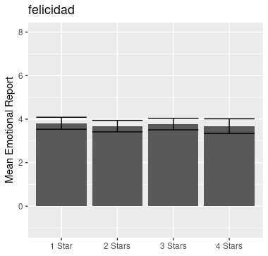

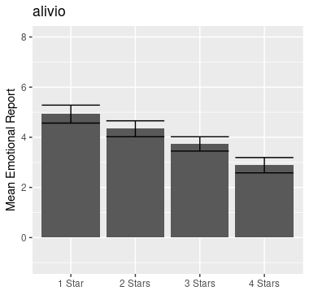

## 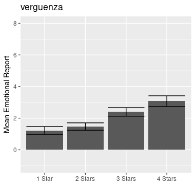

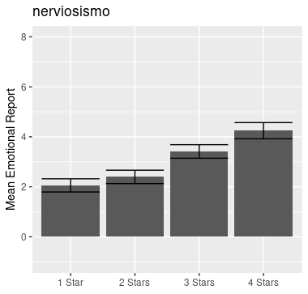

```{}
```

se les pidió a las participantes que calificaran sus emociones (felicidad, culpa, decepción, enojo, tristeza, alivio, vergüenza y nerviosismo) frente a los cuatro tipos de feedback que se obtenían en la tarea a partir de la opción competitiva.

Se encontró un efecto principal del resultado del participante, con los resultados positivos

(cuando el participante se desempeñaba bien) dando lugar a mayores niveles de **felicidad** (F(1,53) = 66.5655 , p\< 0.0001) y **alivio** (F(1,53) = 58.9267, p\< 0.0001 ) y menores niveles de **culpa** (F(1,53) = 58.9267, p\< 0.0001), **decepción** (F(1,53) = 156.2671, p\< 0.0001), **enojó** (F(1,53) = 58.2143, p\< 0.0001), **tristeza** (F(1,53) = 55.3968 , p\< 0.0001 ), **vergüenza** (F(1,53) = 113.4231, p\< 0.0001) y **nerviosismo** (F(1,53) = 74.1915, p\< 0.0001) que los resultados negativos (cuando el participante se desempeñaba mal) (ver Figura 3)

Además, se encontró una interacción entre el resultado del participante y el resultado del rival para **culpa** (F(1,53) = 17.6141, p =4.529e-05), **decepcion** (F(1,53) = 14.4986, p=0.0002012),

**vergüenza** (F(1,53) =25.2051, p = 1.393e-06), **tristeza** (F(1,53) =5.7483, p = 0.01769 ) y **nerviosismo** (F(1,53) = 22.3100, p = 5.135e-06

0.023047). En comparaciones pareadas se observó que cuando el/la participante se desempeñaba bien no existía diferencia en los niveles de estas emociones independientemente de cómo se desempeñara el/la rival (por ejemplo, no hubieron

diferencias significativas en los reportes emociones para la comparación entre las situaciones "Tú bien, Rival bien" y "Tú bien, Rival mal". Sin embargo, cuando el/la participante se desempeñaba mal se observaron mayores niveles de culpa, decepción, vergüenza y nerviosismo para el caso en que el/la rival se desempeñaba bien vs. cuando se desempeñaba mal (mayores niveles de estas emociones para la situación "Tú mal, Rival bien" vs "Tú mal,Rival mal) (p\< 0.0005)

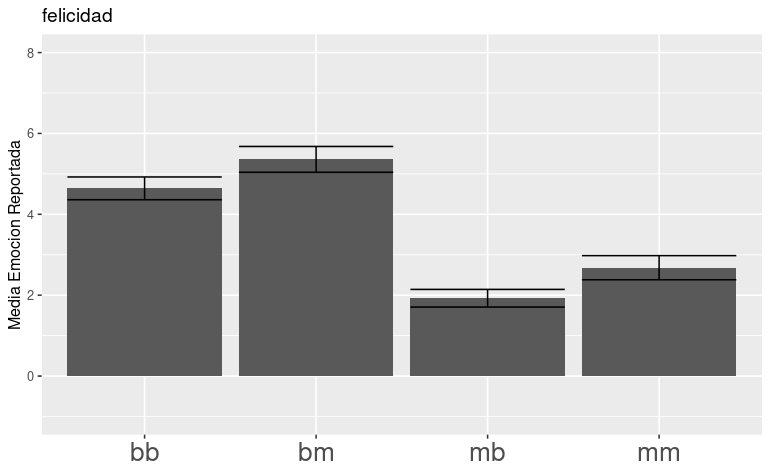

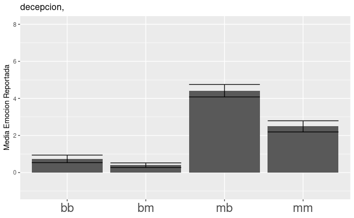](images/paste-D6FB8795.png)

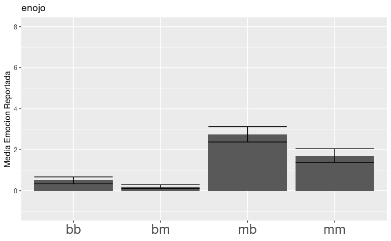

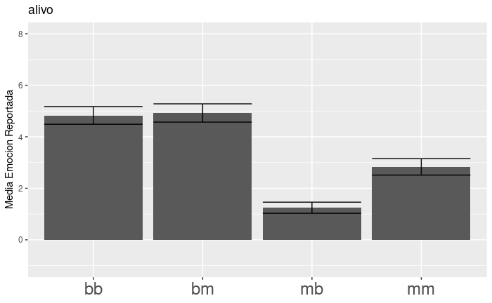](images/paste-FDB7E1BD.png)

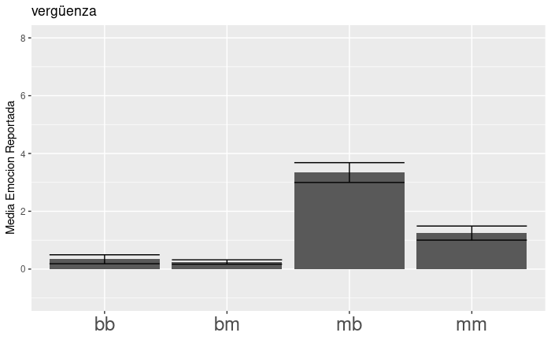

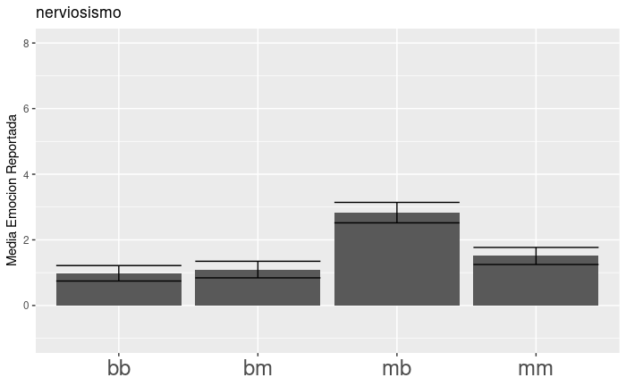

### Análisis de las respuestas comportamentales

Los analisis de la toma de decisiones y tiempos de reacción se realizaron utilizando R (R Core Team, 2020). Para ello se utlzaron Modelos lineales generalizados con efectos mixtos (GLMM,generalized linear mixed model de familia Binomial) para analizar la decisión de los

participantes durante la tarea. El Modelo GLMM fue ajustado para evaluar la relación entre la toma de decisiones, la categoría del rival presentada y el nivel de recompensa ofrecido. La decisión del participante (competir o jugar de forma individual) se introdujo como variable de respuesta.

La variable sujeto fue incluida como efecto aleatorio, mientras que la categoría del rival y el

nivel de recompensa fueron incluidos como efectos fijos. La interacción entre la categoría del rival y la recompensa ofertada fue también incluida. El modelo fue sujeto a un análisis de devianza (similar a ANOVA), realizándose pruebas Chi cuadrado de Wald tipo II. Para realizar las pruebas pareadas se aplicó la corrección de Tukey para comparaciones múltiples.

Para estudiar los tiempos de reacción del/la participante al elegir entre las diferentes opciones de juego (competir o individual) se utilizo un Modelo Lineal con efectos mixtos (LMM). Se ajustó un modelo en el cual el tipo de decisión fue incluido cómo un efecto fijo mientras que el sujeto fue ingresado como efecto aleatorio. El modelo fue sometido a un analisis del tipo ANOVA utlizando la aproximacion de Kenward-Roger a los grados de libertad.

Se encontró un efecto principal del **nivel de recompensa** sobre el tipo de juego elegido (opción competitiva u opción individual) (𝜒2 (3,53) = 592.413, p \< 2.0 x10-16) (ver Figura 4).

```{r}'''}
                             Chisq Df Pr(>Chisq)    
pay_competitive.f         592.4132  3     <2e-16 ***
rival.f                    89.1157  3     <2e-16 ***
pay_competitive.f:rival.f   8.6712  9     0.4682    
---
Signif. codes:  0 ‘***’ 0.001 ‘**’ 0.01 ‘*’ 0.05 ‘.’ 0.1 ‘ ’ 1
'''
```

Las pruebas pareadas mostraron que el nivel de recompensa influian en la toma de decisiones competitivas, cuanto mayor era el nivel de recompens los participantes mas se inclinaban por el juego competitivo. En general se observa, que para el nivel de recompensa de 1 era cuando se optó menos por el juego competitivo (p \<.0001), seguido por el nivel de recompensa de 2 (p \<.0001) y de tres (p \<.0001). Los niveles de recompensa de 3 y 4 no se diferenciaron entre si (p = 0.9996)

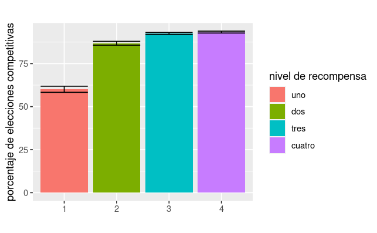
'''fig|fig_4 Porcentaje de veces que los participantes eligieron el juego competitivo segun el nivel de recompensa ofrecido. Las barras de error representan el error estandar de la muestra.
'''

Tambien se encontro un efecto principal de la categoria del rival frente a la elección del tipo de juego (𝜒2 (3,53) = 89.1157 p \< 2.0 x10-16)

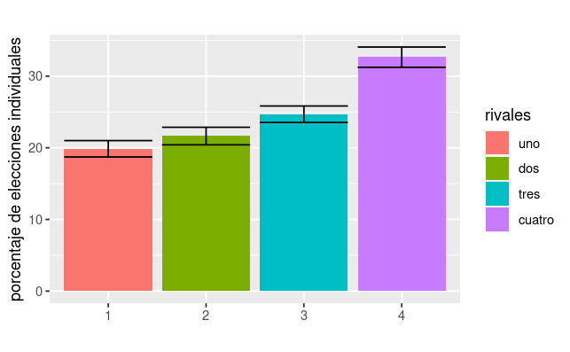

```{r}

```

Las pruebas pareadas mostraron que la categoria del rival influia en la toma de decisiones competitivas, cuanto mayor era la categora del rival masevitaban el juego competitivo. En general se observa, que para el rival de 4 era cuando se optó menos por el juego competitivo (p \<.0001), seguido por el nivel de recompensa de3 (p \<.0001) y dedos (p \<.0001). Los rivales de categoria 1 y 2 no se diferenciaron entre si (p = 0.9999)

### Análisis de las imágenes obtenidas por fMRI

Para el análisis imagenológico se utilizó el paquete SPM12 . Primeramente las imágenes fueron pre-procesadas en donde se realizaron diferentes transformaciones sobre las mismas. Las imágenes obtenidas del escáner fueronrealineadas espacialmente, para así corregir posibles artefactos de movimiento. Todas lasimágenes fueron realineadas a la primera imagen de la primera sesión del experimento.

Posterior a este paso todas las imágenes fueron co-registradas a la imagen anatómica del participante correspondiente, para posteriormente ser normalizadas a un espacio común

utilizando para ello el molde del Instituto Neurológico de Montreal (MNI) que se encuentra

incorporado en el paquete SPM12. Finalmente las imágenes fueron suavizadas utilizando una

curva Gaussiana de anchura media 8 mm centrada en el maximo ("Full-Width-Half-Maximum

Gaussian Kernel")

Para el análisis de primer nivel se realizó un análisis relacionado a eventos (event related

design) a partir del cual se buscó estudiar las activaciones al momento de la toma de decisone y del feedback.

En este análisis la activación al momento de la decisión se modeló con un regresor con los tiempos en los que se presentaban las opciones de juego, modulado paramétricamente por dos regresores ortogonalizados, siendo el primero el nivel de recompensa y el segundo la

categoría del rival. Se incluyeron 6 regresores de interés correspondientes a los 4 posibles

feedback de la opción competitiva ("Tú bien , Rival bien", "Tú bien , Rival mal", "Tú mal , Rival bien" y "Tú mal , Rival mal") y los dos posibles para la opción individual ( "Tú Bien" o "Tú Mal")

Además, se agregaron como variables de no interés seis regresores que consistían en estimaciones de parámetros relacionados al movimiento de la cabeza y obtenidos durante la etapa de realineamiento.

Las imágenes de los contrastes de interés obtenidas en el analsis de primer nivel fueron llevadas al segundo nivel de análisis y las activaciones fueron obtenidas utilizando pruebas t para muestras independientes.

En primera instancia se estudiaron las activaciones cerebrales al momento del feedback.

En primer lugar, se indagó qué regiones cerebrales mostraban una activación diferencial

según el resultado del rival, siempre que el jugador contestaba correctamente la pregunta.

Específicamente, se analizó el contraste (Tú bien , Rival mal) \> (Tú bien , Rival bien). Esto se

hizo con el fin de detectar las regiones que se activan frente a las comparaciones sociales

hacia abajo; es decir, regiones que presentan una mayor activación cuando nos va mejor que

a un otro, comparado con los momentos en que no nos diferenciamos de un otro. Para este

contraste, se observó una mayor activación en las siguientes regiones: ínsula anterior izquierda y corteza dorsolateral, estriado ventral y precuneo.

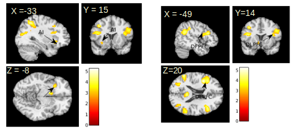

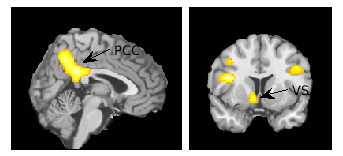

En segundo lugar, se examinó la activación para el contraste (Tú mal, Rival bien) \> (Tú mal,Rival mal), este contraste permite detectar las regiones cerebrales que se activan frente a una comparación social hacia arriba, esto quiere decir cuando el participante se compara con un otro/a que presenta un mejor desempeño. Para este contraste los participantes activaron la corteza cngulada anterior (ACC) y la Insula anterior izquierda.

Esta activacion no es signficativa para un p\< 0.005 y un humbral de 105 voxels

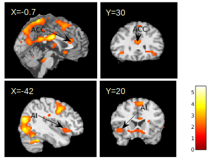

En tercer lugar se examino la activación al momento de tomar la desicion sobre la forma de juego (competivo o individual) segun varia la categoria del rival.

Para el contraste en que aumenta el rival se activan regiones relaconadas con la deteccion del conflicto y la toma de decisiones como la corteza profrontal dorsolateral (DLPFC)

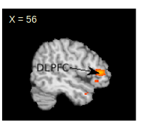

Mientras que el contraste opuesto ( a medida que baja la categoria del rival) los participantes activan regiones como la Insula anterior izquerda y el Nucleo caudado.

No son significativas para el nivel de umbral

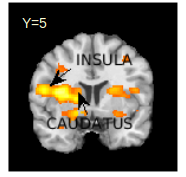

Se estableció un umbral de p \< 0.05 de cluster a nivel de todo el cerebro, para esto se estableció la exigencia conjunta de un p \<0.005 a nivel de vóxel y un tamaño de cluster de 105 voxels contiguos. Y las activaciones para este contraste son significativas

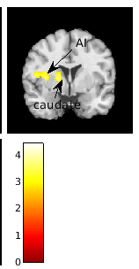

Para finalzar se estudio la influencia del nivel de recompensa sobre las activaciones. Para esto se observo el contraste generado por el regresor parametrico del nivel de recompensa al momento de tomar la decision del tipo de juego (competitivo o indvidual)

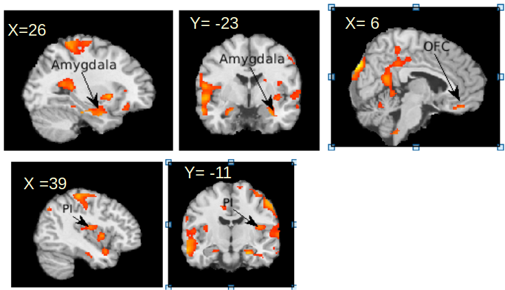

```{r}
#estas regiones no pasan el estadistico de Slotnik
```

Para el contraste opuesto a medida que baja el nivel de recompensa se observo que los participantes activaron las siguientes regiones: corteza cingulada anterior, corteza prefrontal. Estas regiones son significativas para el umbral defindo.

Se estableció un umbral de p \< 0.05 de cluster a nivel de todo el cerebro, para esto se estableció laexigencia conjunta de un p \<0.005 a nivel de vóxel y un tamaño de cluster de 105 voxels contiguos.

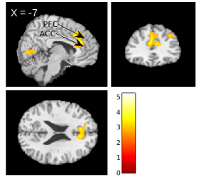

#### Referencias
