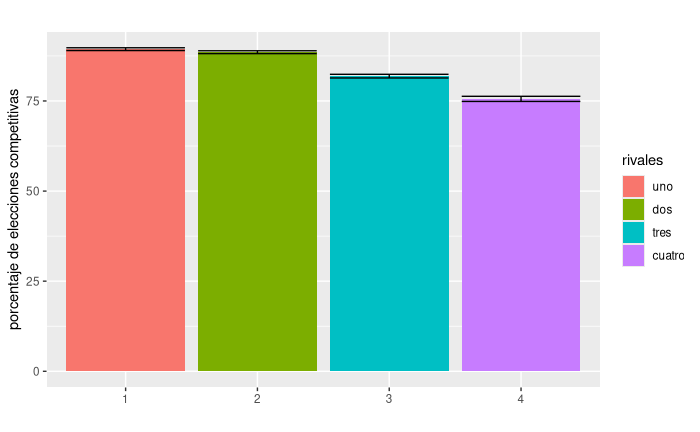
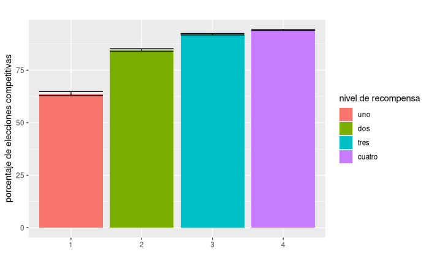
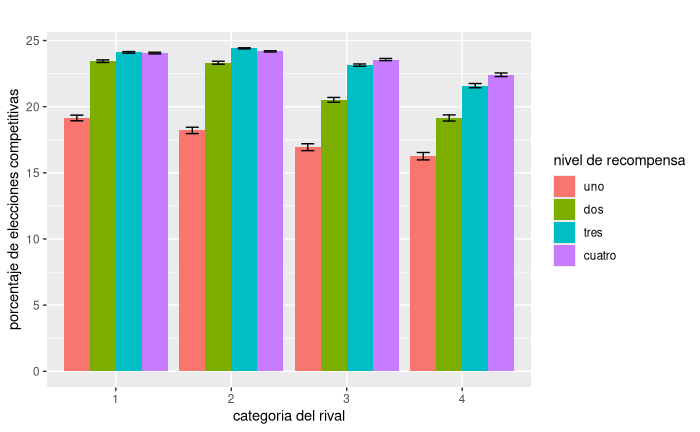

## Toma de decisiones

Se ve un efecto principal del rival (p \< 0.001) con los niveles de elecciones de competencia disminuyendo a mandida que aumenta el juez. Especificamente se observo que para el rival 4 ( p\< 0.001 ) es para el que mas se evita la competencia, seguido para el rival 3 (p \<0.001) y los rivales 2 y 1 que no se diferenciaron entre si.



Para el pago ofrecido a los participantes al momento de volcarse por la eleccion competitiva se observa un efecto principal (p\<0.001). Especificamente se observo que a medida que aumenta el nivel de recompensa ofrecida, los participantes se inclinan mas por elegir la opcion competitiva. siendo el nivel de 1 el que menos eligen, seguido por el nivel de 2 (p\<0.001) y seguido por los niveles de 3 y 4( p\< 0.001). Los niveles de tres y cuatro no se diferenciaron entre si.



```         

Analysis of Deviance Table (Type III Wald chisquare tests)

Response: game_type.f
                                            Chisq Df Pr(>Chisq)    
(Intercept)                               55.0247  1  1.190e-13 ***
rival                                    140.9239  3  < 2.2e-16 ***
scale(BECK_SESION)                         0.0096  1     0.9219    
pay_competitive                          363.5414  3  < 2.2e-16 ***
rival:scale(BECK_SESION)                   1.6512  3     0.6478    
rival:pay_competitive                     58.3638  9  2.767e-09 ***
scale(BECK_SESION):pay_competitive         3.3180  3     0.3451    
rival:scale(BECK_SESION):pay_competitive  14.4405  9     0.1075    
---
Signif. codes:  0 ‘***’ 0.001 ‘**’ 0.01 ‘*’ 0.05 ‘.’ 0.1 ‘ ’ 1
```

Se observo una interaccion significativa entre la categoria del rival y los niveles de recompensa. ( Chisq (9) ; p\< 0.001). Analisis post hoc muestran que a medida que aumenta la categoria del rival las diferencias en las veces que eligen competir para cada uno de los pagos se hace cada vez mas notoria. Los participantes discriminan mejor entre los niveles de recompensa cuando los rivales son mejor calificados. Las opciones se separan mas a medida que aumenta la categoria del rival.



Tambien se observo una interaccion entre la escala de ansiedad social de **Lebowitz** y el pago ofrecido en la opcion competitiva ( Chisq (3) = 10.5 ; p \<0.05).

Se analizó la interacción entre la variable continua **LSAS_Total** (índice psicológico) y la variable categórica **pay_competitive** (niveles 1 a 4) utilizando tendencias estimadas de un modelo lineal generalizado mixto. Los resultados indican que las pendientes de LSAS_Total difieren significativamente entre ciertos niveles de pay_competitive, lo que sugiere un efecto modulador de la estructura de pago competitivo en la relación entre LSAS_Total y la variable de respuesta.

Las pendientes estimadas para cada nivel de **pay_competitive** fueron las siguientes:

-   Nivel 1: β=0.00955\beta = 0.00955β=0.00955, IC 95% \[-0.00914, 0.0282\].

-   Nivel 2: β=0.02689\beta = 0.02689β=0.02689, IC 95% \[0.00765, 0.0461\].

-   Nivel 3: β=0.02874\beta = 0.02874β=0.02874, IC 95% \[0.00887, 0.0486\].

-   Nivel 4: β=0.01528\beta = 0.01528β=0.01528, IC 95% \[-0.00456, 0.0351\].

Se observa que las pendientes para los niveles 2 (p\<0.05p \< 0.05p\<0.05) y 3 (p\<0.05p \< 0.05p\<0.05) son significativamente diferentes de cero, lo que sugiere un efecto positivo de LSAS_Total sobre la variable de respuesta en estos niveles de pay_competitive. En contraste, las pendientes para los niveles 1 y 4 no fueron significativas, ya que sus intervalos de confianza incluyen el valor cero.

Además, las comparaciones entre pendientes indicaron diferencias significativas entre ciertos niveles de pay_competitive. En particular:

-   La pendiente del nivel 2 fue significativamente mayor que la del nivel 1 (Δβ=−0.01733\Delta \beta = -0.01733Δβ=−0.01733, p\<0.0001p \< 0.0001p\<0.0001).

-   De forma similar, la pendiente del nivel 3 fue mayor que la del nivel 1 (Δβ=−0.01918\Delta \beta = -0.01918Δβ=−0.01918, p\<0.0001p \< 0.0001p\<0.0001).

-   No se encontraron diferencias significativas entre los niveles 2 y 3 (p=0.9780p = 0.9780p=0.9780), lo que sugiere efectos similares en estos niveles.

-   Sin embargo, las diferencias entre los niveles 3 y 4 resultaron marginalmente significativas (Δβ=0.01346\Delta \beta = 0.01346Δβ=0.01346, p=0.0443p = 0.0443p=0.0443).

Estos resultados sugieren que el efecto de LSAS_Total sobre la variable de respuesta depende significativamente del nivel de pay_competitive. En particular, los niveles de pago competitivo intermedio (2 y 3) parecen potenciar el impacto de LSAS_Total, mientras que el nivel más bajo (1) y el más alto (4) no muestran asociaciones significativas.

# Tiempos de reaccion

(POR VER)

# Emociones frente a la categoria del rival
